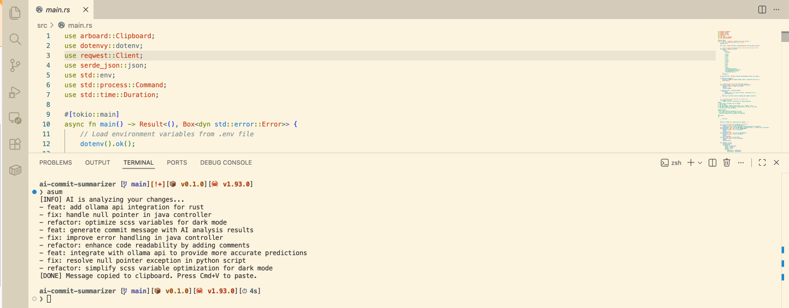

# asum (AI Commit Summarizer)

**asum** is a lightweight CLI tool written in Rust that automatically generates professional git commit messages using local AI models. It helps developers maintain a clean and consistent commit history without the manual effort of summarizing changes.

---

## Features

- **Local AI**: Uses [Ollama](https://ollama.com/) to run models locally (default: `llama3.2:1b`), ensuring your code stays private.
- **Smart Filtering**: Automatically filters `git diff` to focus on relevant source code while ignoring lock files and binaries.
- **Clipboard Integration**: Automatically copies the generated commit message to your system clipboard.
- **Configurable**: Easily adjust AI parameters and system settings via a `.env` file.

---

## Requirements

Before installing, ensure you have the following tools set up:

1. **Rust & Cargo**: [Install Rust](https://www.rust-lang.org/tools/install)
2. **Ollama**: [Download Ollama](https://ollama.com/) and ensure it is running.
3. **AI Model**: Pull the default model used by the tool:
   ```bash
   ollama pull llama3.2:1b
   ```

---

## Installation

1. **Clone the repository**:
   ```bash
   git clone https://github.com/thangtt/ai-commit-summarizer.git
   cd ai-commit-summarizer
   ```

2. **Configure environment**:
   ```bash
   cp .env.example .env
   ```

3. **Run the installer**:
   ```bash
   chmod +x install.sh
   ./install.sh
   ```
   *Note: The installer will compile the project in release mode and move the binary to `/usr/local/bin`.*

---

## Usage

Simply stage your changes and run `asum`:

```bash
git add .
asum
```



The tool will analyze your staged changes, display a suggested commit message, and copy it to your clipboard. You can then simply press `Cmd+V` (or `Ctrl+V`) to paste it into your `git commit` command.

---

## Uninstallation

To remove the tool from your system:

```bash
chmod +x uninstall.sh
./uninstall.sh
```

---

## Configuration

You can customize the tool by editing the `.env` file:

- `OLLAMA_MODEL`: Change the AI model (e.g., `llama3:8b`).
- `AI_TEMPERATURE`: Adjust the creativity of the AI.
- `MAX_DIFF_LENGTH`: Limit the size of the diff sent to the AI.
