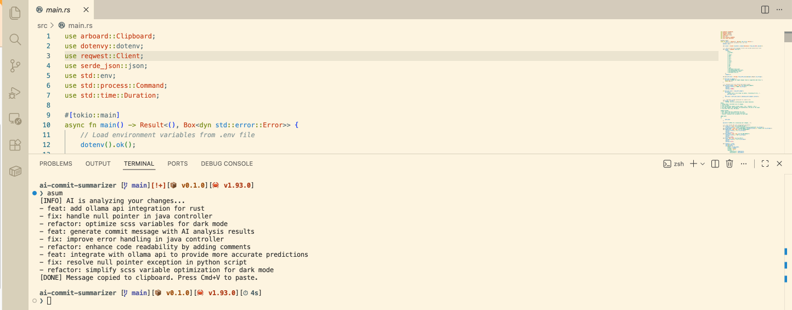

# asum (AI Commit Summarizer)


[](https://opensource.org/licenses/MIT)
[](https://www.rust-lang.org/)
[](https://conventionalcommits.org)

**asum** is a lightweight, blazing-fast CLI tool written in Rust that automatically generates professional git commit messages using AI models. It helps developers maintain a clean, consistent, and meaningful commit history effortlessly by adhering to the **Conventional Commits 1.0.0** specification.

---

## Quick Start: Installation & Uninstallation

Get up and running in seconds. No complex setup or compilation required.

### One-Command Install
Detects your OS and architecture, downloads the latest pre-compiled binary, and adds it to your path automatically:

```bash
curl -fsSL https://raw.githubusercontent.com/tranthethang/ai-commit-summarizer/main/bin/install.sh | bash
```

### One-Command Uninstall
Completely removes `asum` and its configurations from your system:

```bash
curl -fsSL https://raw.githubusercontent.com/tranthethang/ai-commit-summarizer/main/bin/uninstall.sh | bash
```

<details>
<summary>Build from Source (Alternative)</summary>

If you prefer building from source using Rust:
```bash
git clone https://github.com/tranthethang/ai-commit-summarizer.git
cd ai-commit-summarizer
make release
sudo cp target/release/asum /usr/local/bin/
```
</details>

---

## Features

- **Strict Conventional Commits**: Generates standardized headers matching `<type>(<scope>): <description>` and detailed bodies.
- **Multi-Provider Support**: Integrate with Google Gemini, OpenAI, Google Vertex AI, Ollama, Groq, Mistral AI, or GitHub Models.
- **Intelligent File List Fallback**: If you stage changes that are not source code (e.g. assets, lock files, binary files, or ignored extensions), `asum` automatically falls back to summarizing based on the list of staged filenames so you never get empty diff errors.
- **Diff Reduction & Tree View**: Formats staged files as a clean directory tree and supports advanced diff reduction/truncation modes (by file or by hunk) to keep large diffs within AI model context limits.
- **Context-Aware System Prompts**: Employs Few-Shot Prompting and precise system instructions to guarantee high-quality, concise, and structured commit proposals.
- **Smart Diff Filtering**: Focuses only on relevant source code files, ignoring noise like lock files, large generated assets, or binaries.
- **Clipboard Integration**: Copies the final message to your system clipboard automatically so you can paste it immediately.

---

## Supported Providers

**asum** supports a wide range of cloud and local AI backends. Click a provider for its dedicated configuration details:

| Provider | Default Model | Configuration Guide | Use Case | Free Tier |
| :--- | :--- | :--- | :--- | :--- |
| **GitHub Models** | `gpt-4o-mini` | [GitHub Models Setup Guide](./docs/providers/github.md) | Access to 40+ models via GitHub PAT authentication. | Yes |
| **Google Gemini** | `gemini-flash-latest` | [Gemini Setup Guide](./docs/providers/gemini.md) | High quality, low latency, free/pay-as-you-go. | Yes |
| **Google Vertex AI** | `gemini-flash-latest` | [Vertex AI Setup Guide](./docs/providers/vertexai.md) &middot; [gcloud Install Guide](./docs/gcloud-setup.md) | Enterprise environments, auto-authenticates via `gcloud`. | No |
| **Groq** | `llama-3.3-70b-versatile` | [Groq Setup Guide](./docs/providers/groq.md) | Blazing-fast LPU inference for open models. | Yes |
| **Mistral AI** | `mistral-small-latest` | [Mistral AI Setup Guide](./docs/providers/mistral.md) | Powerful open-weights and commercial French LLMs. | No |
| **Ollama** | `qwen2.5-coder:3b` | [Ollama Setup Guide](./docs/providers/ollama.md) | 100% Local, private, and offline execution. | Yes |
| **OpenAI** | `gpt-5.1-mini` | [OpenAI Setup Guide](./docs/providers/openai.md) | Industry standard, OpenAI-compatible APIs (LM Studio, vLLM). | No |

---

## Usage

Simply stage your changes and run `asum` in your terminal:

```bash
# 1. Stage your changes
git add .

# 2. Generate and copy the commit message
asum
```



`asum` will analyze your staged diff (or file list), output the suggested commit message, and copy it to your system clipboard. Simply press `Cmd+V` (or `Ctrl+V`) to paste it into your `git commit` command.

### CLI Options

The `asum` command supports the following options:

- `asum` — Run the default summarization flow.
- `asum -v` or `asum --verbose` — Run with verbose logging. This will print the full diff/prompt sent to the AI, and the full JSON response received from the AI, which is useful for debugging.
- `asum verify` — Verify your `asum.toml` configuration syntax and structure.
- `asum --help` — Print help information.
- `asum --version` — Print version information.

---

## Configuration

**asum** loads its configuration from a file named `asum.toml`. It searches for this file in the following order:
1. **Local**: The current working directory (useful for project-specific models/settings).
2. **Global**: Your user home directory at `~/.asum/asum.toml`.

### Example `asum.toml`

Customize the AI settings, active provider, and parameters. For a full template with all supported providers and advanced parameters, see [asum.toml.example](./asum.toml.example).

Here is a minimal configuration using Google Gemini:

```toml
[general]
active_provider = "gemini"
max_diff_length = 36000

[gemini]
api_key = "YOUR_GEMINI_API_KEY"
model = "gemini-flash-latest"
```

### Config Verification

Verify the syntax and completeness of your `asum.toml` by running:

```bash
asum verify
```

### Provider Fallback

If the active provider fails (rate limit, timeout, API errors, etc.), **asum** can automatically retry with alternative providers. Add a `fallbacks` list to your `[general]` section:

```toml
[general]
active_provider = "openai"
fallbacks = ["github", "mistral", "groq"]
max_diff_length = 36000

# Configure each fallback provider below
[openai]
api_key = "sk-..."
model = "gpt-5.1-mini"

[github]
api_key = "ghp_..."
model = "gpt-4o-mini"

[mistral]
api_key = "..."
model = "mistral-small-latest"

[groq]
api_key = "gsk_..."
model = "llama-3.3-70b-versatile"
```

The retry order follows the `fallbacks` list exactly. The maximum number of retries equals the number of providers in the list.

---

## Testing & Coverage

### Running Tests
To run the automated Rust tests:
```bash
make test
```

### Coverage Report
Generate a detailed HTML coverage report using `grcov`:
```bash
# Prerequisites
cargo install grcov
rustup component add llvm-tools-preview

# Run the coverage generator
make coverage
```
The resulting HTML report will be generated at `./coverage/index.html`.

---

## CI/CD and Automation

For details on how pre-compiled binaries are built and released via GitHub Actions, see the [Automation and Releases Documentation](./docs/automation-and-releases.md).
